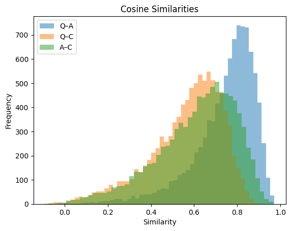
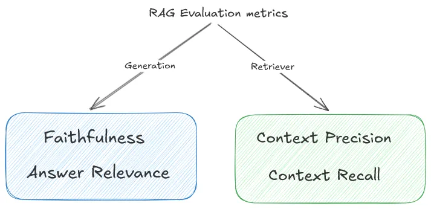
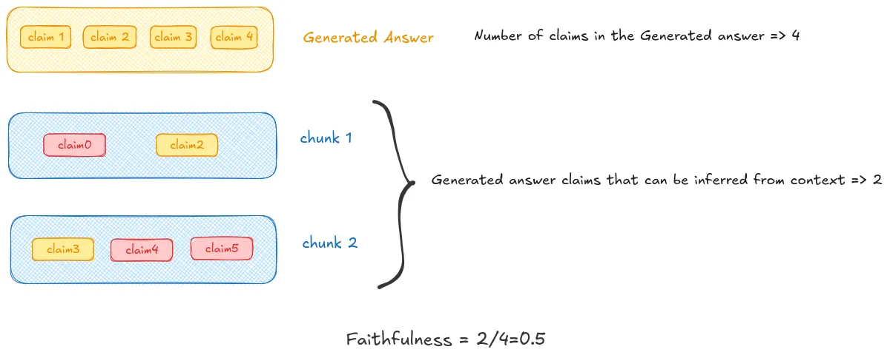
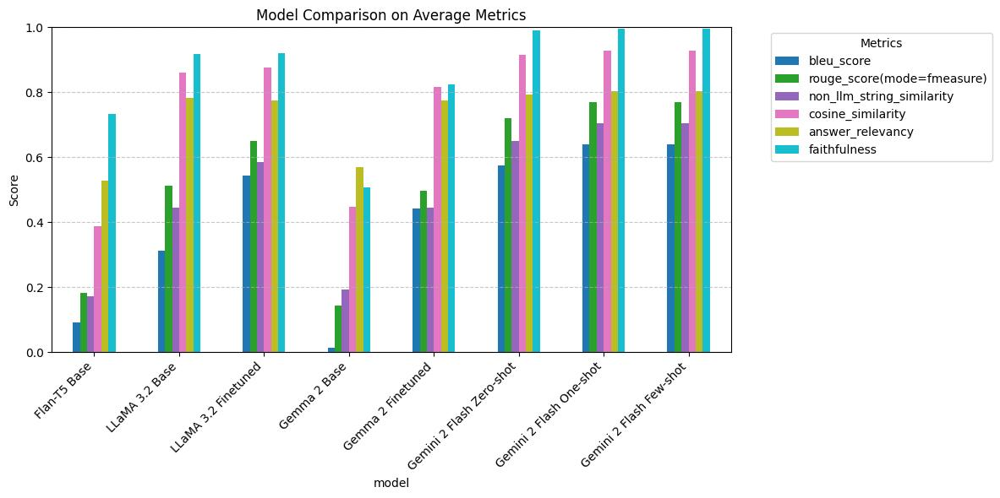

# 📚 RAG-Based NLP Pipeline with Evaluation and Voice Assistant

## ☁️ Cloud Group Members
- [Safuan IUSUPOV](www.linkedin.com/in/safuan-iusupov-484084337)
- Shodai FUJIMOTO  
- [Dorsa MOTIALLAH](https://www.linkedin.com/in/dorsa-motiallah-236444188?utm_source=share&utm_campaign=share_via&utm_content=profile&utm_medium=ios_app)
- [Darkhan ISLAM](https://www.linkedin.com/in/dmazhi/)
- [Hadjer BRIOUA](https://www.linkedin.com/in/hadjer-b-6265b3211?utm_source=share&utm_campaign=share_via&utm_content=profile&utm_medium=android_app)

---

# 🎞 [VIDEO presentation of project](https://drive.google.com/file/d/1ZGzyo7bupjO7vRZbzOZn4nuerszCkxWu/view?usp=sharing)

---

## 🧠 Project Overview

This project explores a full NLP pipeline built around **Retrieval-Augmented Generation (RAG)**.  
It combines classical NLP and deep learning techniques to analyze, evaluate, and enhance language models.  
The project culminates in a fully **local voice-interactive assistant** powered by a context-aware RAG system.

---

## 🗂️ Key Components

### 1. RAG Dataset (12,000 samples)
- Structured as `(context, question, answer)`
- Built for optimizing retrieval-based generation
- Source: [Neural Bridge AI](https://huggingface.co/datasets/neural-bridge/rag-dataset-12000)

---

### 2. Embedding & Semantic Analysis
- Word2Vec trained on raw and POS-tagged text
- Visualized with **t-SNE**
- Clustered with **K-Means**
- POS-tagging improved syntactic granularity

---

### 3. Semantic Similarity
- Cosine similarity between context, question, and answer
- Findings:
  - Answers are semantically closer to context
  - Questions tend to be more abstract and diverse

---

### 4. Sentence Transformers vs Word2Vec
- Sentence Transformers (`all-MiniLM-L6-v2`) captured deeper meaning
- Better separation in clustering and visualization
- More accurate semantic similarity



---

### 5. Classical Retrieval Methods
- **TF-IDF** and **BM25** used for context retrieval
- Top-1 accuracy: ~5%
- Conclusion: classical retrieval alone is insufficient for open-domain QA

---

### 6. RAG Evaluation Metrics

- **Faithfulness** – factual alignment with the context

- **Answer Relevance** – semantic alignment with the question

- Other metrics: BLEU, ROUGE, Levenshtein, Cosine Similarity

---

### 7. Prompt Engineering with Gemini 2.0 Flash
- Strategies tested: **Zero-Shot**, **One-Shot**, **Few-Shot**
- One-shot prompting significantly improved output quality and structure

---

### 8. LLM Fine-Tuning with LoRA + PEFT
- Model: `google/flan-t5-base`
- Fine-tuned to generate summaries (answers) from context + question
- Used **Low-Rank Adaptation (LoRA)** for efficient parameter updates
- Lightweight and suitable for modest hardware

---

### 9. Model Evaluation Summary

| Model                  | Faithfulness | Relevance | BLEU  | ROUGE | Notes                                  |
|------------------------|--------------|-----------|-------|--------|----------------------------------------|
| Gemini 2 (base)        | High         | High      | Low   | Low    | Lacks answer formatting                |
| Gemini 2 (1-shot)      | High         | High      | High  | High   | Formatting improved with example       |
| Gemini 2 (few-shot)    | ≈ One-shot   | ≈ One-shot| ≈ One-shot| ≈ One-shot| No added benefit over one-shot         |
| Gemma 2 (base)         | Low          | Low       | Low   | Low    | Poor out-of-the-box performance        |
| Gemma 2 (fine-tuned)   | High         | High      | High  | High   | Strong improvement with fine-tuning    |
| LLaMA 3.2 (base)       | Medium–High  | High      | Medium| Medium | Solid performance without fine-tuning  |
| LLaMA 3.2 (fine-tuned) | High         | High      | High  | High   | Best overall results                   |



---

### 10. 🎙️ Voice-Interactive Assistant (Offline RAG)

#### 🔧 Features
- Fully offline (no external APIs)
- Microphone input + local speech-to-text (Whisper)
- Local LLM via [Ollama](https://ollama.com)
- Context retrieval using FAISS + embeddings
- Local speech output (Bark TTS)

#### 🛠 Requirements
- Python 3.11
- Ollama + `llama3.2:1b`
- Packages: `langchain`, `transformers`, `faiss-cpu`, `openai-whisper`, `scikit-learn`, `rich`, etc.

```bash
pip install langchain langchain-core transformers faiss-cpu openai-whisper scikit-learn rich
```

✅ Key Takeaways
-	RAG enhances LLMs by providing external knowledge and increasing factual correctness.
-	Sentence Transformers outperform traditional embeddings in capturing deep semantics.
-	Prompting techniques like one-shot significantly improve generation quality.
-	Fine-tuning with LoRA offers a lightweight and efficient way to adapt LLMs.
-	Voice-based RAG assistants are feasible and powerful even without cloud APIs.

📁 Repository Structure
```
├── README.md
├── images/                        # images with some results and examples
├── pyproject.toml/                # configuration for ChatBot
├── notebooks/ 
│   ├── individual
│   └── Cloud_final_notebook.ipynb # All result presented here
├── LLM_results/
├── audio/
├── src/                   
│   ├── tts.py
│   └── voiceChatBot.py            # To run VoiceInteractive ChatBot
└── word2vec_models/
```

📌 License & Credits
- Dataset: [Apache 2.0 License](https://www.apache.org/licenses/LICENSE-2.0.html)
- Model: Hugging Face Transformers & Vertex AI
- Project inspired by work from [Neural Bridge AI](https://www.neuralbridge.ai/)
